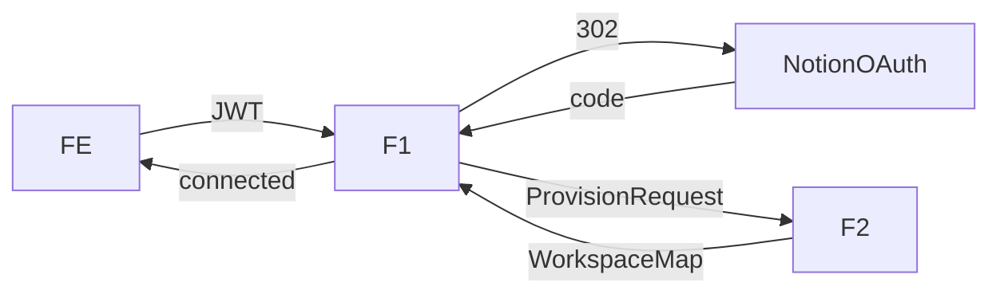
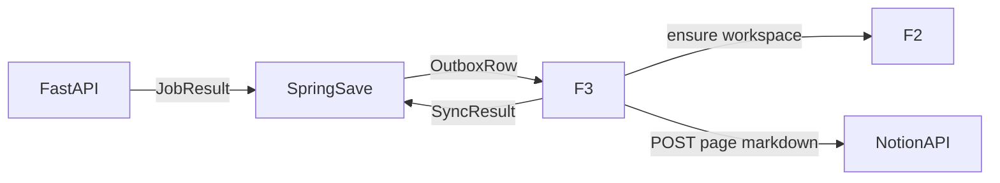

# Blocki Notion DESIGN

- project: Blocki-Notion (Spring 모듈 `com.blocki.notion`)
- version: 1.0
- one-liner: Spring이 보관한 산출 `.md`를 유저 Notion 워크스페이스에 로그로 미러하는 모듈. FastAPI는 호출하지 않음
- date: 2026-08-19
- module count: 3 features (F1–F3), C0 없음
- scale verdict: **Small** — `Blocki-Backend` 코드 0파일. Feature 레벨만. C0 금지로 시작
- depends on: `Docs/README.md`, `Blocki-AI/DESIGN.md` v0.2

## TOC

1. Tech stack
2. Folder tree
3. Main pipeline
4. C0 modules
5. Extension points
6. Feature modules
7. Team contracts (요약)
8. Dependency table
9. Implementation checklist
10. Design Decision Log

상세 절차·curl·스키마 예시는 형제 `.md`에 있다. 이 파일은 구조의 원본이다.

---

## 1. Tech-stack table

이미 잠겼거나, 이 설계가 기본값으로 고정한 값. 구현 중 바꾸려면 이 표와 §10을 같이 고친다.

| 영역 | 기술 | 이유 |
| --- | --- | --- |
| 위치 | `Blocki-Backend` 패키지 `com.blocki.notion` | 유저·JWT·토큰 금고·스케줄이 Spring 소유 (`Blocki-AI/DESIGN.md` §7.1) |
| HTTP | Spring Web `RestClient` | 공식 Java SDK가 없다. 해커톤에서 의존성 하나 줄인다 |
| Notion 쓰기 | REST `https://api.notion.com/v1` | 멀티유저 크론에 맞다. 토큰을 우리가 들고 있다 |
| API 버전 | 헤더 `Notion-Version: 2026-03-11` | 현재 최신. data source parent를 쓴다 |
| 인증 | Public connection OAuth 2.0 | 유저마다 워크스페이스가 다르다. Internal 토큰 하나로 못 푼다 |
| 토큰 금고 | Spring이 GitHub PAT와 같은 암호화 방식 | 유저별 완전 격리. Notion 모듈은 평문을 디스크에 쓰지 않음 |
| 페이지 본문 | `POST /v1/pages` 의 `markdown` 필드 | FastAPI가 이미 `.md`를 준다. 블록 JSON 수작업 금지 |
| 트리거 | Spring이 proposal을 DB에 저장한 뒤 outbox | FastAPI는 Notion을 모른다 |
| 호스트 MCP `https://mcp.notion.com/mcp` | 로컬 디버그 전용 | OAuth audience가 REST 토큰과 다르다. 크론 쓰기 경로가 아님 |
| 캘린더 | 제외 | 팀 합의 |
| 배포 | 기존 Spring Docker | 새 프로세스 없음 |

선택하지 않은 것:

- FastAPI에서 Notion MCP 호출
- `JobRequest.notion` 필드 부활
- 호스트 MCP 세션을 유저별로 붙잡아 크론에 재사용
- 오픈소스 `notion-mcp-server`를 프로덕션 쓰기에 넣기 (유지보수 종료 안내)
- 별도 `Blocki-Notion` 마이크로서비스 (1차)
- Notion을 포폴 원본으로 쓰기
- LLM이 Notion tool을 자유롭게 돌리기

---

## 2. Folder tree

Spring 패키지. 피처끼리 import 금지. 조립은 `NotionConfig`만 한다.

```
Blocki-Backend/
  src/main/java/com/blocki/notion/
    NotionConfig.java                 # composition root
    api/
      NotionConnectController.java    # F1 공개 HTTP
    connect/
      NotionOAuthService.java         # F1
    provision/
      NotionWorkspaceProvisioner.java # F2
    mirror/
      NotionArtifactMirror.java       # F3
    client/
      NotionRestClient.java           # HTTP + retry. 모듈 아님 (함수 묶음)
    crypto/
      NotionTokenVault.java           # 기존 금고 어댑터. 모듈 아님
    contracts/
      NotionContracts.java
  src/main/resources/
    application.yml                   # notion.oauth.*, notion.api.*
  src/test/java/com/blocki/notion/
    NotionOAuthServiceTest.java
    NotionWorkspaceProvisionerTest.java
    NotionArtifactMirrorTest.java
    NotionConnectControllerTest.java
```

`NotionRestClient` / `NotionTokenVault`는 모듈 바닥 미달이다. F1–F3가 인자로 받는다.

---

## 3. Main pipeline

연결 (한 번, 브라우저 필요):



미러 (크론·수동 잡 이후, 브라우저 없음):



제안 라인은 항상 `SpringSave → F3`. F3가 워크스페이스가 없으면 F2를 부르지 않고, **root가 조립**한다.

```
handle_saved_proposal(proposal):
  if not connected: skip
  if should_skip(proposal): skip
  workspace = load_or F2.provision(...)
  F3.mirror(proposal, workspace)
```

조건 분기는 위 함수(조립) 안에만 있다.

### OUT→IN chain (연결)

| 단계 | OUT | 다음 IN |
| --- | --- | --- |
| Frontend | JWT + (선택) return_to | F1 start |
| Notion | `code`, `state` | F1 callback |
| F1 | `ProvisionRequest` + access token (aux, 모델 밖) | F2 |
| F2 | `WorkspaceMap` | F1 persist |
| F1 | `NotionStatus` | Frontend |

### OUT→IN chain (미러)

| 단계 | OUT | 다음 IN |
| --- | --- | --- |
| FastAPI | `ArtifactProposal` | Spring DB (원본) |
| Spring | `MirrorRequest` | F3 |
| F3 | `SyncResult` | Spring outbox/log |

### 파이프라인 실패 정책

- Notion 쓰기는 **부가 작업**이다. 실패해도 `JobResult.ok`를 뒤집지 않는다.
- 토큰 없음 / 연결 해제: `skipped/not_connected`. 재시도 없음
- 401 후 refresh 성공: 같은 요청을 한 번 더
- 401 후 refresh `invalid_grant`: `needs_reauth`. outbox는 `failed`로 두고 유저에게 재연결 알림
- 429 / 529: `retry(5)` + `Retry-After`. 그래도 실패하면 outbox `failed` retryable=true
- 404 object_not_found: 워크스페이스 맵이 죽은 것. F2를 다시 돌리고 한 번 재시도. 또 실패하면 `workspace_missing`
- `no_change` / 빈 `body_markdown`: `skipped/empty`. 페이지를 만들지 않음
- `blocked` / `failed` proposal: 쓰지 않음

---

## 4. C0 modules

none.

거부 기록:

- HTTP 클라이언트 — F1/F2/F3가 같은 `NotionRestClient`를 쓰지만, 바닥 미달(재시도 함수). 패키지 `client/`에 둔다.
- 토큰 암호화 — 기존 Spring 금고 재사용. 새 모듈 아님.
- 마크다운 변환기 — Notion이 `markdown` 필드를 받는다. 우리 변환기 없음.
- MCP 팩토리 — 프로덕션 사용처 0.
- AgentBase / 레지스트리 / DI 컨테이너 — 구현체 코드 없음. Spring `@Configuration` 한 장이면 충분.

---

## 5. Extension points

계약: `mirror(req: MirrorRequest, tokens: NotionTokens, workspace: WorkspaceMap) -> SyncResult`

| proposal.kind | DB | 제목 규칙 |
| --- | --- | --- |
| `progress` | Progress Logs | `{yyyy-MM-dd} 진행 메모` |
| `portfolio` | Portfolio Versions | `portfolio {template_version} {yyyy-MM-dd HH:mm}` |
| `resume` | Resume Versions | `resume {template_version} {yyyy-MM-dd HH:mm}` |
| `readme` | 1차 안 씀 | — |

선택 맵: `NotionConfig.MIRROR_TARGETS`.

variant 추가: 맵 한 줄 + DB 하나(F2 스키마에 컬럼). `readme`는 2차에 이 맵에 넣는다.

`portfolio` / `resume`는 별 variant가 아니다. `kind`로 부모 DB만 고른다.

---

## 6. Feature modules

### 공유 타입 (`NotionContracts`)

```
NotionJobKind = "progress" | "portfolio" | "resume"   # 1차. readme는 2차

OAuthStart
  user_id: uuid
  return_to: string | null          # 프론트 복귀 경로. allowlist만

OAuthCallback
  code: string
  state: string
  error: string | null

NotionTokens                        # 메모리·응답에 넣지 않음. vault 전용
  access_token: str
  refresh_token: str
  access_expires_at: datetime
  refresh_expires_at: datetime | null
  token_type: "bearer"

ConnectionIdentity
  bot_id: str
  workspace_id: str
  workspace_name: str | null
  workspace_icon: str | null
  notion_user_id: str | null
  duplicated_template_id: str | null

NotionStatus
  connected: bool
  workspace_name: str | null
  workspace_icon: str | null
  root_page_url: str | null
  last_sync_at: datetime | null
  last_sync_status: "succeeded" | "failed" | "skipped" | "running" | null
  needs_reauth: bool

ProvisionRequest
  user_id: uuid
  workspace_id: str
  duplicated_template_id: str | null

WorkspaceMap
  root_page_id: str
  progress_db_id: str
  progress_data_source_id: str
  portfolio_db_id: str
  portfolio_data_source_id: str
  resume_db_id: str
  resume_data_source_id: str
  schema_version: "v1"

MirrorRequest
  user_id: uuid
  proposal_id: str                 # 멱등 키
  job_id: str
  kind: NotionJobKind
  status: "proposed" | "partial"   # 그 외는 F3 진입 전 skip
  body_markdown: str
  title_hint: str | null
  template_ref: {kind: str, version: str, sha256: str} | null
  proposal_digest: str
  snapshot_digest: str | null
  collected_at: datetime | null
  extra_properties: map<str, str>  # repo_count 등. 없으면 빈 맵

SyncResult
  proposal_id: str
  status: "created" | "duplicate" | "skipped" | "failed"
  page_id: str | null
  page_url: str | null
  skip_reason: SkipReason | null
  error: NotionError | null

SkipReason = "not_connected" | "empty_body" | "no_change"
           | "not_mirrorable" | "disconnected"

NotionError
  code: "oauth_denied" | "oauth_state" | "missing_code"
      | "token_exchange" | "needs_reauth" | "rate_limited"
      | "workspace_missing" | "validation" | "notion_auth"
      | "notion_forbidden" | "payload_too_large" | "internal"
  message: str
  retryable: bool
```

`structured: dict`, `github_pat`, `notion_access_token` 은 JSON 모델에 넣지 않는다.

### F1 NotionConnect

PUBLIC: `NotionOAuthService`

진입점:

- `start(req: OAuthStart) -> RedirectUrl`
- `handleCallback(cb: OAuthCallback) -> NotionStatus`
- `disconnect(user_id) -> NotionStatus`
- `status(user_id) -> NotionStatus`

IN (main): `OAuthStart` / `OAuthCallback` / `user_id` ← Frontend·Spring Security

IN (aux):

- `oauth_client_id`, `oauth_client_secret`, `redirect_uri` ← `NotionConfig` (`application.yml`)
- `vault` ← 기존 암호화기
- `provision_fn` ← F2
- `state_signer` ← Spring (JWT 또는 HMAC). state에 `user_id` + nonce + exp

OUT: `NotionStatus`

FAIL:

- 유저가 Cancel: `oauth_denied`. 연결 상태 유지(기존 토큰 삭제하지 않음)
- state 불일치/만료: `oauth_state`. 토큰 교환 안 함
- code 교환 실패: `token_exchange`
- 헤더 JWT 없음: HTTP 401 (모듈 진입 전)

내부 로직:

1. `GET /api/integrations/notion/connect`
   - CSRF `state` 발급. Redis 또는 signed cookie에 10분 TTL
   - `https://api.notion.com/v1/oauth/authorize?owner=user&client_id=...&redirect_uri=...&response_type=code&state=...` 로 302
2. `GET /api/integrations/notion/callback`
   - `error=access_denied` 이면 프론트 `?notion=denied`
   - state 검증
   - `POST https://api.notion.com/v1/oauth/token`
     - Basic `base64(client_id:client_secret)`
     - body JSON `{grant_type: authorization_code, code, redirect_uri}`
   - 응답의 `access_token`, `refresh_token`, `bot_id`, `workspace_*`, `owner` 저장
   - `expires_in`이 있으면 `access_expires_at = now + expires_in - 60s`
   - 없으면 access를 7일로 가정하지 **말고**, 첫 401에서 refresh
   - F2 `provision` 호출
   - 프론트 `return_to?notion=connected` 로 302
3. `POST /api/integrations/notion/disconnect`
   - 토큰 행 삭제. Notion 페이지는 지우지 않음 (유저 소유)
   - `WorkspaceMap`은 남겨 두되 `connected=false`. 재연결 시 workspace_id가 같으면 재사용
4. refresh (F1 내부 함수, HTTP 아님)
   - 유저당 단일 비행. DB row lock 또는 Redis lock `notion:refresh:{user_id}`
   - `POST /v1/oauth/token` `{grant_type: refresh_token, refresh_token}`
   - 새 `refresh_token`이 오면 **원자적으로** 교체. 예전 토큰으로 재시도 금지
   - `invalid_grant` → `needs_reauth=true`, 토큰 삭제

constraints:

- access/refresh를 로그·응답·프론트 JSON에 넣지 않음
- callback은 공개 엔드포인트지만 state + 일회성 code로만 동작. 세션 쿠키가 있으면 `user_id`를 state와 교차검증
- 브라우저에서 token exchange 금지. 서버만 호출

parallel-safe: no (같은 user refresh 경쟁). lock으로 흡수.

REMOVE: `connect/` + `api/NotionConnectController` 삭제 + `NotionConfig` 빈 제거. F2/F3는 호출자가 없어짐.

---

### F2 WorkspaceProvision

PUBLIC: `provision(req: ProvisionRequest, access_token: str) -> WorkspaceMap`

IN (main): `ProvisionRequest` ← F1 또는 조립기 (미러 전 복구)

IN (aux): `access_token` ← vault. 타입/로그 밖

OUT: `WorkspaceMap`

FAIL: 페이지 생성 403 → `notion_forbidden` (유저가 페이지를 안 골랐거나 capability 부족). 404 → `workspace_missing`.

내부 로직 (멱등):

1. 이미 `WorkspaceMap`이 있고, `GET /v1/pages/{root_page_id}` 가 200이면 그대로 반환
2. 루트 페이지가 없으면 생성
   - OAuth 템플릿을 쓰면 `duplicated_template_id`를 루트로 사용
   - 없으면 `POST /v1/pages` `parent.workspace = true`, title `Blocki`
3. 루트 아래에 DB 3개가 있는지 검색 (제목 + 부모가 루트)
   - 없으면 `POST /v1/databases` 로 생성. 스키마는 `04-workspace-schema.md`
4. 각 DB를 `GET /v1/databases/{id}` 하고 `data_sources[0].id`를 저장. 페이지 쓰기의 parent는 **data_source_id**
5. `schema_version=v1` 저장

constraints:

- 유저가 고른 페이지 밖을 만들지 않음. workspace parent가 403이면, 유저가 picker에서 고른 첫 페이지 아래에 루트를 만든다. 구현: callback 직후 `GET /v1/search` 로 접근 가능한 page 1개를 parent로 쓴다
- DB 속성 이름은 영어 고정. UI 표시 이름을 나중에 바꿔도 API key는 유지
- 스키마 마이그레이션은 `schema_version`이 올라갈 때만. 1차는 v1만

parallel-safe: no (같은 유저 이중 생성). unique `(user_id)` + 조회 후 생성.

REMOVE: `provision/` 삭제. F1 callback에서 루트 URL이 비고, F3는 `workspace_missing`.

---

### F3 ArtifactMirror

PUBLIC: `mirror(req: MirrorRequest, tokens: NotionTokens, workspace: WorkspaceMap) -> SyncResult`

IN (main): `MirrorRequest` ← Spring outbox

IN (aux): tokens, workspace, `notion_client`

OUT: `SyncResult`

FAIL: 401→refresh 후 1회 재시도. 429→retry. digest/본문 검증 실패 `validation`. 본문 500KB 초과 `payload_too_large`.

내부 로직:

1. `kind`로 data_source_id 선택
2. 해당 data source를 query: property `Proposal ID` equals `req.proposal_id`
   - 한 행이라도 있으면 `duplicate` + 그 page_url. POST 하지 않음
3. `POST /v1/pages`
   ```json
   {
     "parent": { "type": "data_source_id", "data_source_id": "..." },
     "properties": { "...": "04-workspace-schema.md 값" },
     "markdown": "<body_markdown>",
     "icon": { "type": "emoji", "emoji": "📝" }
   }
   ```
4. `body_markdown` 길이가 80_000자를 넘으면 `"allow_async": true` 를 넣고 202를 받는다. `status_url`을 폴링 (`GET /v1/async_tasks/{id}`)
5. page_id / url 을 outbox에 기록

constraints:

- LLM 없음
- GitHub를 부르지 않음
- 원본 `.md`를 고치지 않음. 앞에 메타 callout만 붙이는 것은 허용 (`07-markdown-and-pages.md`)
- default 페이지를 통째로 덮어쓰지 않음. 항상 **새 행**
- 같은 proposal을 두 워커가 동시에 써도 query+unique outbox로 한 페이지에 수렴. Notion에 unique constraint가 없으므로 레이스는 “두 행”이 생길 수 있다. 완화: outbox `proposal_id` UNIQUE, 상태를 `running`으로 CAS

parallel-safe: no (같은 proposal). outbox unique가 락.

REMOVE: `mirror/` 삭제. 연결·프로비저닝은 남고 로그만 안 쌓임.

---

## 7. Team contracts (요약)

전문은 `01-team-contracts.md`.

| 담당 | 한다 | 하지 않는다 |
| --- | --- | --- |
| **Notion** | OAuth, 금고 어댑터, 워크스페이스 생성, `.md` 미러, outbox | GitHub MCP, 승인, 템플릿 문구 생성, FastAPI 수정 |
| **Spring 공통** | 유저/JWT, proposal 원본 DB, 스케줄이 Job을 FastAPI에 POST, Notion outbox enqueue | Notion API 세부 (이 모듈에 위임) |
| **AI / FastAPI** | Job/Execute, GitHub MCP, 3개 산출 | Notion 페이지 |
| **Frontend** | 연결 버튼, 상태 배지, 재연결 CTA | 토큰 보관 |

저장 순서 (팀 합의, 잠김):

1. FastAPI가 `body_markdown` + digest를 반환
2. Spring이 proposal 행을 커밋 — **원본**
3. Notion 연결이 있으면 outbox insert
4. F3가 같은 `.md`를 페이지로 남김
5. 3–4가 실패해도 1–2는 유지

---

## 8. Dependency table

| 모듈 | 사용 |
| --- | --- |
| F1 | Notion OAuth, vault, F2 |
| F2 | Notion REST pages/databases/search |
| F3 | Notion REST pages + data source query, F2 OUT |
| C0 | 없음 |

순환 없음. F3가 F1을 부르지 않는다. refresh는 F1의 함수를 조립기가 aux로 넘긴다.

---

## 9. Implementation checklist

세부 날짜는 `08-implementation-playbook.md`.

1. [ ] Notion Developer portal에 Public connection 생성. capability: Read / Insert / Update content
2. [ ] `application.yml` + `NotionConfig`
3. [ ] F1 start/callback/disconnect/status. 토큰은 vault. 로그 마스킹
4. [ ] 로컬 PAT로 `users/me` + `pages` markdown 생성 스크립트
5. [ ] F2 루트 + DB 3개 + data_source_id 저장. 두 번 실행해도 같은 맵
6. [ ] outbox 테이블 + proposal 저장 훅
7. [ ] F3 progress 미러 + `Proposal ID` 중복 → `duplicate`
8. [ ] F3 portfolio/resume 미러
9. [ ] Frontend 연결 버튼 + `needs_reauth` 배지
10. [ ] 429/401/empty/not_connected 테스트
11. [ ] (2차) readme 로그, 팀 보드 — `12-phase-2.md`

경계 테스트 (최소):

- F1: 잘못된 state → 400. deny → 기존 연결 유지
- F1: refresh 동시 2회 → 토큰 한 쌍만 생존
- F2: 이미 있는 루트 → 새로 안 만듦
- F3: 같은 proposal_id 두 번 → 페이지 1개
- F3: FastAPI `no_change` → Notion 호출 0
- F3: Notion 500 → proposal 행은 `proposed` 유지

---

## 10. Design Decision Log

```
[SCALE  ] Small — Feature only, no C0
[KEEP   ] Spring이 원본, Notion은 미러 — Blocki-AI DESIGN §7.4
[KEEP   ] FastAPI는 Notion 미호출 — JobRequest.notion CUT 유지
[SPLIT  ] F1 connect / F2 provision / F3 mirror
          변경 이유: OAuth 수명 vs 스키마 vs 쓰기 멱등. 테스트가 갈림
[MERGE  ] status/disconnect → F1 — 항상 연결과 같이 움직임
[LOCAL  ] NotionRestClient, vault adapter — 모듈 바닥 미달
[CUT    ] 호스트 MCP를 프로덕션 쓰기 경로로 사용
          MCP 토큰 audience ≠ REST. 수명 8시간. DCR 클라이언트 고아 문제
[KEEP   ] 호스트 MCP URL은 로컬 디버그 메모로만 — 11-mcp-vs-rest.md
[CUT    ] 별도 Blocki-Notion 프로세스 — 해커톤 배포 단위
[CUT    ] 캘린더, 팀 보드, 일정 대비 진행률 — 2차
[CUT    ] LLM + Notion tool 자유 루프 — GitHub F2와 같은 이유
[CHANGE ] 페이지 본문은 markdown 필드 — 블록 JSON 수작업 거절
[CHANGE ] 페이지 parent는 data_source_id (2026-03-11)
[KEEP   ] 분석→제안→승인→실행 은 GitHub 쪽. Notion은 승인 없음
[CHANGE ] Notion 실패는 Job 실패가 아님
[KEEP   ] 유저별 토큰 격리, 암호화, 로그 금지
[LOCAL  ] HMAC approval_grant — Notion과 무관
[VARIANT] Mirror targets {progress, portfolio, resume}
[LOCAL  ] readme 미러 — 1차 0 요구. 맵만 열어 둠
```

[self-check: 13/13 passed — C0 none; greenfield; extension 3 variants logged; HMAC 해당 없음; 병렬 수량은 사용자 미제시라 parallel mark만]
